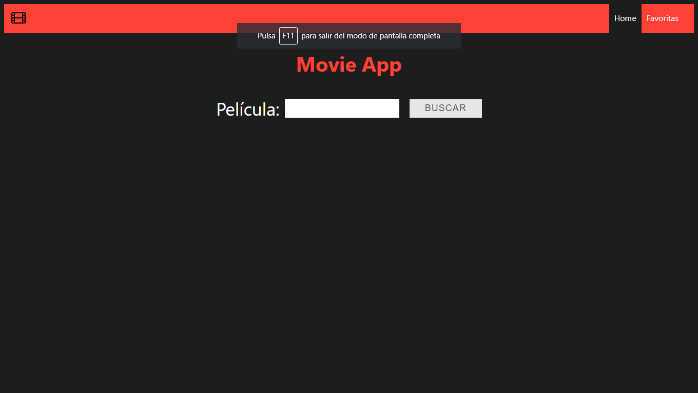
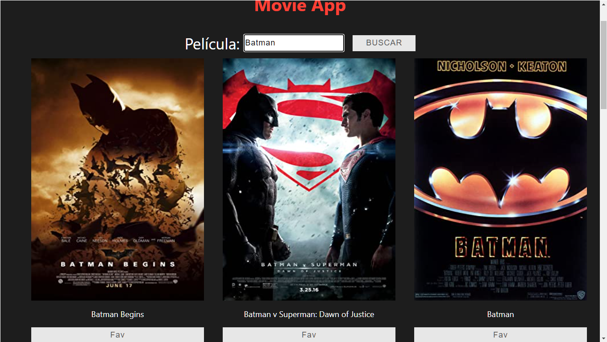
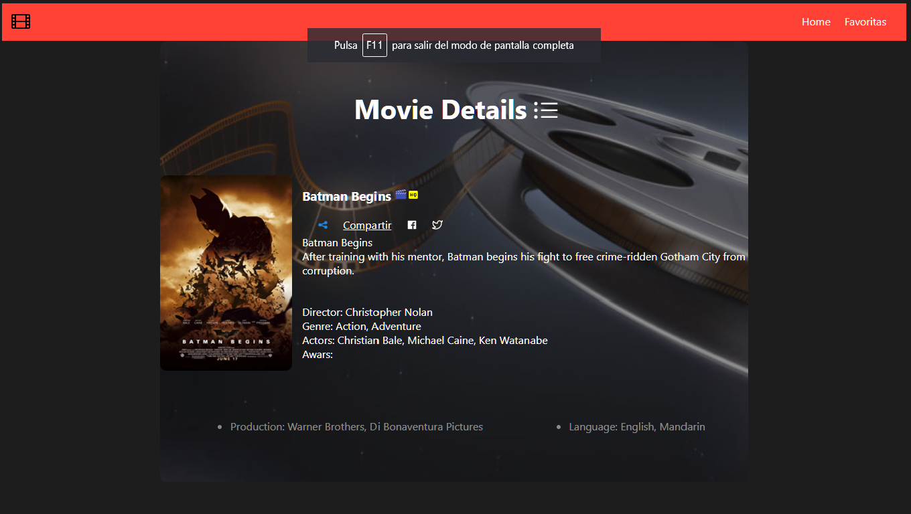
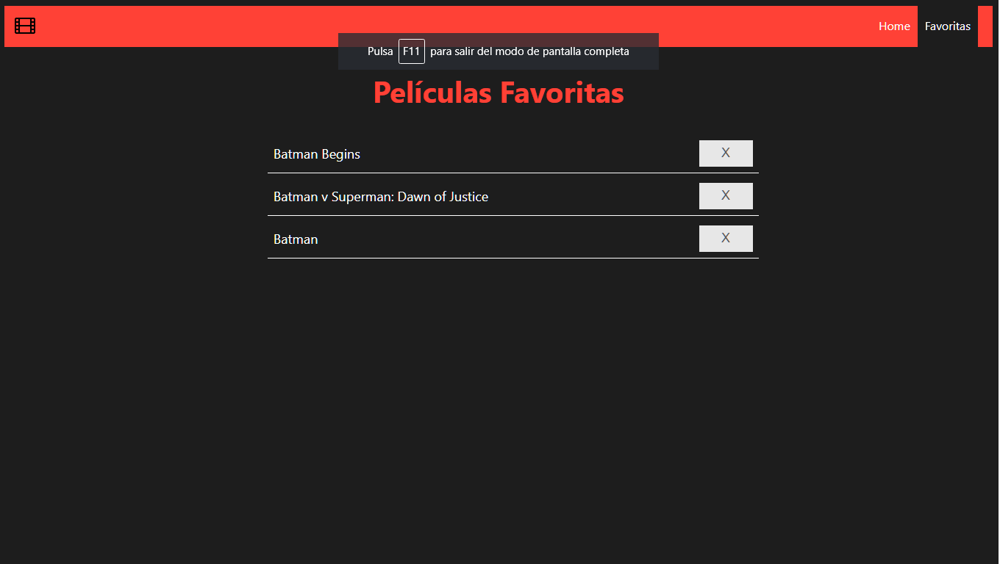

# Links
App: <a href="https://movie-app-mumeishon.netlify.app/">>>>>>HERE<<<<<</a>  
GitHub: <a href="https://github.com/webDesignMumeishon/movie-app">>>>>>HERE<<<<<</a>

# Individual Project -  Movie App

The project consists of calling an API (http://www.omdbapi.com/). Before showing anything, we must first type in the search bar one movie name, after the API is called, a set of movies in the / page is shown with the name written to see a variety of items, we can click over one name and access to details about the title, plot, director, genre, actors, production, language, etc. We can add to favorites any movie we want, the selected movie will automatically disappear from the initial set and displace to the favorite section. Once in the movie section we can see all the added movies and delete them.

In conclusion we can:

* Look for movies and list them.
* See all the details about a particular movie.
* Add movie to favorites.
* Remove movie from favorites.

### Installation

To install the app in your local machine you have to execute the following command inside the directory to install all the dependencies:
npm install

## Technologies
Front-end:
- [ ] React
- [ ] Redux

#### Frontend
It was used React/Redux
Here some pictures of the implementation with the styling:

<h3>"/"</h3>

__main page__:
- [ ] Search bar

    

    

<h3>"/movie/:movieid"</h3>

__details__:
- [ ] Movie details

    

__favorites__:
- [ ] Movie favorites

    

